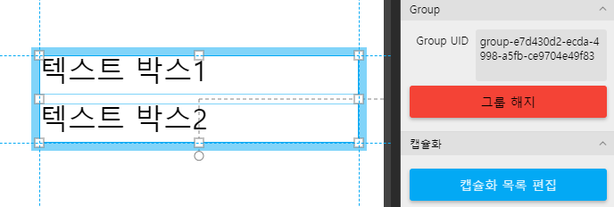
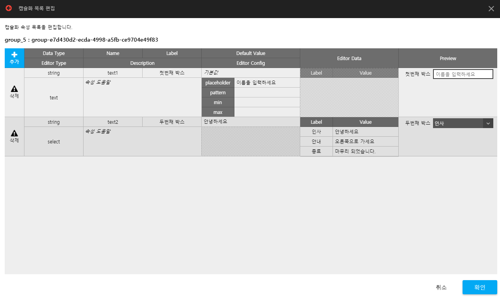
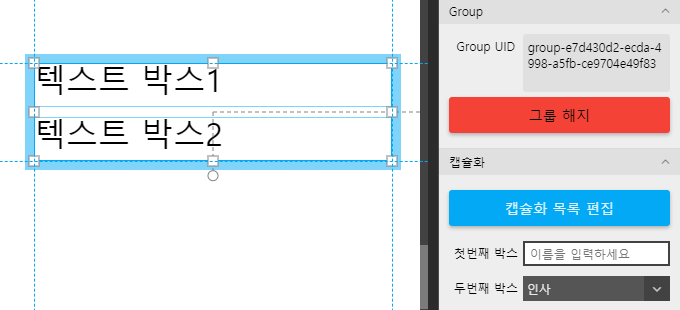
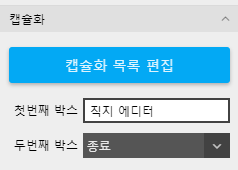
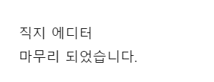

# 컴포넌트 만들기

#### 그룹화하기

두개의 `텍스트` element를 생성한 후 `그룹으로 지정 버튼`을 눌러 그룹화 합니다.



#### 기능 구현

그룹을 선택한 상태에서 `initialize` 이벤트 창을 열 `스크립트 작성` 항목을 선택한 후 옵션에 따라 달라지는 동작을 구현합니다.

```
    var textbox1 = $self.children('element-9df72b7f-69c5-4ea9-b065-41be67589c31');
    var textbox2 = $self.children('element-b5aa4e4c-b6fb-4903-a4a3-0c5114416096');

    console.error('text1 : ', textbox1.api.text());
    console.error('text2 : ', textbox2.api.text());
    console.error('capsule : ', $self.capsule);
    /*
    //output
    text1 : 텍스트 박스1
    text2 : 텍스트 박스2
    capsule: {}
    */
```

현재 캡슐화 작업은 진행하지 않았으므로 `$self.capsule` 값은 빈 오브젝트를 출력합니다.

`$self.capsule`에 `text1`, `text2` 라는 변수가 전달된다고 가정하고 텍스트박스 문자열을 바꾸는 코드를 작성하겠습니다.

```
    var textbox1 = $self.children('element-9df72b7f-69c5-4ea9-b065-41be67589c31');
    var textbox2 = $self.children('element-b5aa4e4c-b6fb-4903-a4a3-0c5114416096');

    // text1, text2 값으로 문자 표시 변경
    textbox1.api.text($self.capsule.text1);
    textbox2.api.text($self.capsule.text2);
```

#### 캡슐화 목록 편집창

이벤트 설정창을 닫고 다시 속성창으로 돌아와 `캡슐화 목록 편집` 버튼을 눌러 편집창을 엽니다. 이제 편집창에서 `text1`, `text2` 라는 변수에 대한 정보를 설정하면 속성창에 두 변수에대한 설정 UI가 자동으로 생성됩니다.



`text1` 변수는 일반 `input box`, `text2` 변수에 대해서는 `select box` Form으로 설정하였습니다.

`확인` 버튼을 눌러 창을 닫습니다.



속성창에 `캡슐화`항목을 보면 방금 설정한 두개의 변수에 대한 설정 UI가 자동으로 설정되어져 있습니다.

#### 동작 확인 미리보기

두개의 설정 UI에서 적절한 값을 선택한 후 미리보기에서 동작을 확인합니다.





### &#x20;<a href="#componentexport" id="componentexport"></a>
