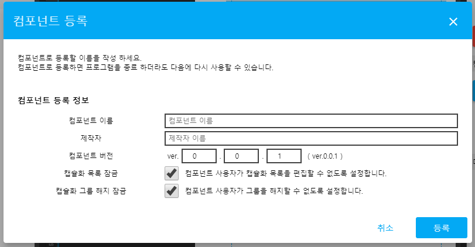
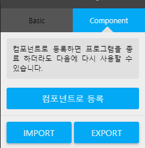
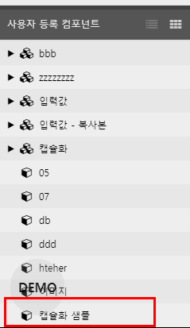
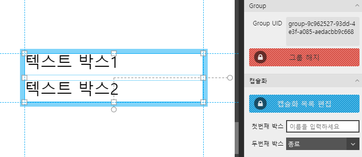
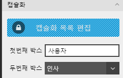

# 컴포넌트 Export/Import

### 컴포넌트 Export 

#### 컴포넌트 등록

그룹 선택 상태에서 컴포넌트 Export 버튼을 눌러 export 창을 엽니다.

`캡슐화 목록 잠금`을 선택하면 배포된 컴포넌트 사용자는 캡슐화 목록을 더이상 편집할수 없습니다. 컴포넌트 이름을 입력한 후 `확인` 버튼을 눌러 컴포넌트로 등록합니다.

#### 컴포넌트 Export

컴포넌트 아이템창으로 이동하여 컴포넌트 `export` 버튼을 클릭합니다. 등록된 컴포넌트 목록중 방금 등록한 `캡슐화 샘플` 이름의 항목을 선택한 후 `확인`버튼을 눌러 파일(\*.jjc)로 export 합니다.

### 컴포넌트 Import하여 사용하기

컴포넌트 아이템창에서 'import' 버튼을 눌러 export한 `캡슐화 샘플` 파일(\*.jjc)을 import 합니다. 컴포넌트 아이템창 하단 목록에 import 된것을 확인합니다.

#### 컴포넌트 Export

새로운 문서를 추가하고 `캡슐화 샘플` 컴포넌트를 화면에 드래그하여 추가합니다.

 속성창을 보면 `그룹 해지` 버튼과 `캡슐화 목록 편집` 버튼이 비활성화 되어 있습니다. 컴포넌트를 export할때 잠금 설정한 값이 적용된 것입니다.

#### 동작 확인하기

두개의 설정 UI에서 적절한 값을 선택한 후 미리보기에서 동작을 확인합니다.

