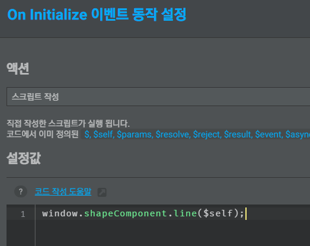

# Element에서 JS 파일 동적으로 로드

외부JS 파일을 사용하여  콤포넌트를 제작할때 다음 과정을 거치게 됩니다.

1. 외부 파일 설정창에서  JS 파일을  등록합니다.\
   
2. 페이지에 Element를 하나 삽입합니다.
3. Element의  이벤트창의 \`initialize\` 이벤트에서 JS파일의 함수를 호출합니다.\
   .png>)
4. Element를 콤포넌트로 등록합니다.
5. 콤포넌트로 등록할때 JS 파일이 포함되도록 선택해 줍니다.\
   .png>)

이렇게 만든 콤포넌트는 여러 페이지에 걸쳐 사용될 수도 있는데 주의할 점은 콤포넌트를 사용할  때에도 항상 외부 파일 설정창에서 JS 파일을 등록하고 페이지 별로 JS 파일 로드 여부를 관리해야 합니다.

콤포넌트 내에서 동적으로 외부 JS 파일을 로드해서 사용하면 이런 번거로움은 없어질것 같습니다.

* 외부 파일 설정창을 사용하지 않아도 됨
* 콤포넌트가 사용될때만 자동으로 스크립트가 로드됨
* 콤포넌트가 여러번 사용되더라도 JS 파일은 한번만 로드되어야 함

## JS 파일 동적 로드

다음 코드를 initialize 이벤트에 작성하여 스크립트를 한번만 로드합니다.

```javascript
  function loadJS(jsURL, run){
    // JS 파일 중복 실행 방지
    var scriptTag = document.querySelector('script[src="' + jsURL + '"]');
    if(scriptTag) return onLoaded(scriptTag);
    
    // JS 파일 로드
    var tag = document.createElement('script');
    tag.src = jsURL;
    tag.setAttribute('dynamic-load-js', 'loading');
    var firstScriptTag = document.getElementsByTagName('script')[0];
    firstScriptTag.parentNode.insertBefore(tag, firstScriptTag);
    onLoaded(tag);
    
    // JS 파일 로드되면 실행
    function onLoaded(scriptTag){
      var loaded = (scriptTag.getAttribute('dynamic-load-js') !== 'loading');
      if(loaded) return run();
      scriptTag.addEventListener('load', function(event){
        scriptTag.setAttribute('dynamic-load-js', '동적 로드 (Jik-ji API)');
        run();
      });
    }
  }
```

\`loadJS\` 함수를 사용하여 JS 로드 후 실행될 함수를 호출합니다.

```
  // JS 로드 후 실행 (중복 로드 방지)
  loadJS('./{exportRoot}/shapeComponent.js', function (){
        // JS 파일 내의 코드 호출
        // window.shapeComponent.line($self);
  });
```

이제JS 파일에서 콤포넌트의 기능을 구현하면 됩니다.\
콤포넌트로 등록할때 역시JS 파일을 포함시켜 줘야 합니다만, 콤포넌트를  사용할때는 JS 파일을 별도로 등록하지 않아도 됩니다.


```
Jik-ji 3.1.44 버전 이상에서는 위에서 사용한 loadJS 함수가 내장되어 API를 통해 바로 사용할 수있습니다.

$self.loadJS('./{exportRoot}/shapeComponent.js', function (){
      // window.shapeComponent.line($self);
});
```


